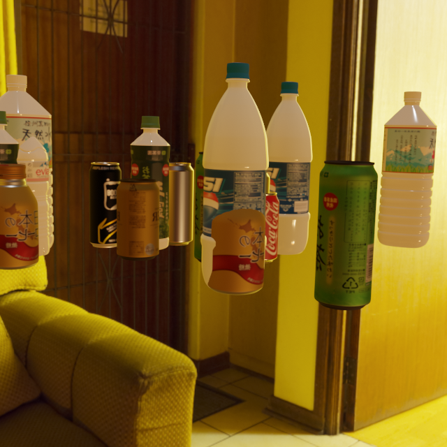
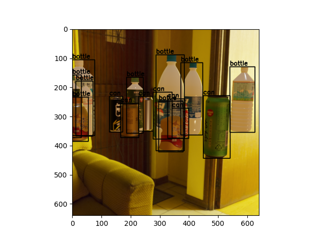

# "Bottle" and "Can" detector
This project generates synthetic dataset for bottle and can  and train a object detector on the generated dataset. The dependencies for the code can be found in [requirements.txt](requirements.txt) file.To install the necessary dependencies, run the following command:

```bash
pip install -r requirements.txt
```

# Syntethic data generation
The data generation code uses [Blender 3.4](https://docs.blender.org/api/3.4/) python API for rendering and capturing scenes to generate data. The code currently uses 5 `.hdr` background files in `hdris` folder. for every background, it generates 5 different camera angles and randomly places objects in the scene. So 1 batch of code generates `5*5 = 25` images. You can initiate data generation by executing the below command. 
```bash
python data_generate.py --dir dataset/train/images --ann dataset/train/annotations_train.json --batches 1
```
- **--dir** : type`str`. directory to store images generated. *default*: `dataset/train/images`
- **--ann** : type`str`. directory and file with `.json` extension to store annotation file. *default*: `dataset/train/annotations_train.json`
- **--batches** : type`int` Number of batches *default* : `1`
> **NOTE**: This is an extensively RAM heavy code and still could use a lot of optimizations. depending on various random parameters it could take anywhere between 2 to 4 minutes to generate one image and at its peak could use 2 to 4 GB of RAM at once.




# Object detector
Below explained are the indiviual components of this model. We need to setup `config.py` file with some configurations like`batch_size`,`epochs`,`res_dir` etc. Please refer to [config.py](config.py) to set the dependencies.
## Data loader
The model uses `CustomDataset` class implemented in [datasets.py](datasets.py) file to retrieve data and its respective annotations from the provided directories in `config.py`. You can run the following command
```bash
python datasets.py
```
After successful  execution, the code should generate sample images with annotations for visualization purposes.


## Model

The model(s) for this is implemented in [model.py](model.py) file. There are implementation of 2 models in this file.

- `InbuiltSSD` : Here I used the inbuilt [SSD300](https://pytorch.org/vision/main/models/generated/torchvision.models.detection.ssd300_vgg16.html) model with pretrained `COCO` weights with a modified classification head for our use case.
- `ResnetWithAnchors` : This is the implementation of a custom **SSD** model that uses [ResNet](https://pytorch.org/vision/main/models/generated/torchvision.models.resnet34.html) architecture with pre-trained `ImageNet` weights as the backbone and custom anchors of `[2,3,4]` aspect ratios for the classification head.

> **NOTE**: This version of the project, it is required user to manually switch between the models. The code currently uses `InbuiltSSD` architecture for training and inference. If you want to use `ResnetWithAnchors` architecture you need to make changes in [model.py \(ln 66\)](https://github.com/rvnandwani/drink_detection_tele/blob/412920c6dc5c9070781fdd303e5db13331ea5e83/model.py#L65) , [train.py \(ln 104\)](https://github.com/rvnandwani/drink_detection_tele/blob/5f3bd063e3c4b4d3824912caa9b984ace7322f7b/train.py#L104) , 
 and [inference.py \(ln 38\)](https://github.com/rvnandwani/drink_detection_tele/blob/412920c6dc5c9070781fdd303e5db13331ea5e83/inference.py#L38)

You can run the following to display model and its architecture.
```bash
python model.py
```

## Training
The file [train.py](train.py) is responsible for model training. Model will be trained for `epochs` with `batch_size` and output model checkpoint and plots will be stored in `res_dir` as specified in [config.py](config.py). The model uses `torchmetrics` inbuilt `MeanAveragePrecision` function to keep track of the accuracy and save both `best_model.pth` and `last_model` along with `mAP` and `training_loss` graphs.
You can run training by running the following command
```bash
python train.py | tee output_logs.txt
```
You can find my training logs for [`ResnetWithAnchors`](outputs_resnet_e25/Resnet_logs.txt) and [`InbuiltSSD`](outputs_ssd_e35/SSD_logs.txt)

## Inference
Once the training is done we can run the following command to generate inferences from the model
```bash
python inference.py --input target_images --model outputs/best_model.pth --output inference_outputs/images
```
- **--input** : type`str`. directory for input images on which inference will be conducted
- **--model** : type`str`. directory and file of model checkpoint to be used. *default*: `outputs/best_model.pth`
- **--output** : type`str`Number of batches *default* : `inference_outputs/images`

## Observation and Results

### Reason for the model

I used `InbuiltSSD` model because of its known versatility and performance, being optimized and trained on COCO dataset it has been known to perform well in all general object scenarios. So this model generates good results and establishes benchmarks for me to compare with my own implementation.
There were multiple motivations for me to make my own model. When we see the SSD300 architecture it uses VGG16 like backbone for feature extraction. I experimented with using a ResNet architecture for the same as ResNet architecture helps with capturing hierarchical features at various image sizes. For the head, I experimented with custom anchors of 3 different aspect ratios to capture the tall objects of our use case as both test and training images had tall standing bottles

### Observation
Visually inspecting the `target_images` \[[SSD](inference_outputs/ssd_target_images/) , [ResNet](inference_outputs/resnet_target_images/) \] and validation set results\[[SSD](inference_outputs/ssd_val_images/) , [ResNet](inference_outputs/resnet_val_images) \], along with observing the `mAP` plots of validation set, `InbuiltSSD` model outperforms our custom `ResnetWithAnchors` model I could think of the following reasons for the same
1. `ResnetWithAnchors` classification head is not flexible in handling varying object sizes as it has uniform channels for feature extraction and classification
2. The presence of relatively more wide range of scale i.e. 0.07 to 1.05 in `InbuiltSSD` model compared to 0.15 to 1.0 in `ResnetWithAnchors` could have provided finer granularity for smaller objects combined with the `steps` could help in better localization as well.

### Future Improvements
Data generation code could be optimized further to generate even more samples with almost similar resources. For example, the current version renders a whole scene with all the background, camera positions, and other assets for every image that gets generated, so instead of that, once the scene is rendered we can try different camera angles and light parameters and positions in that scene itself with all its objects and backgrounds to generate images rather than generating the whole scene again. To further improve the dataset quality I would explore the blender library more and try to generate more life-like data with varied lighting conditions and different light types, add reflection and transparent surfaces (for bottles), and include some real-life annotated data \(as in `target_images`\) and train the model again. Based on the requirement, I would try and clean the data in a way that heavily occluded objects don't get included in the training set as that might be hurting the performance of accurately detecting objects, so setting some threshold like min 20% of the object is visible in the frame then only it should get annotated and trained upon. This might help in reducing the significant number of False positives in our inference. That would help in achieving better accuracy in real-life implementations. I will experiment with the above-mentioned observations and inferences to improve the model architecture as well.
